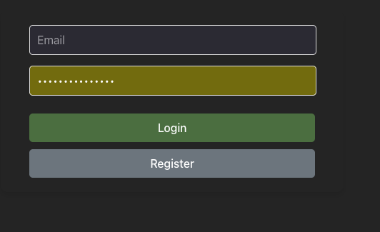
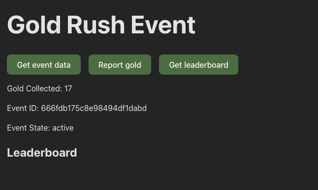

 # Gold Rush Event

## Installation and run in local environment

1. Install docker 
2. Run command `docker-compose up` in the root directory of the project

That's it. Both server and client are ready to use.

## Run app for testing
1. Open browser and go to `http://localhost:5179/`
2. Register a new user
3. Login with the registered user

App image is shown below

### Game

  1. Click `Get event data` to get the current running event
  2. click Report gold to report the gold
  3. Click `Get leaderboard` to get the leaderboard for the event

### To finish the game early 
  1. Go to `http://localhost:8081/` and login to mongoexpress using admin/password credentials
  2. Go to `goldrush` database and `events` collection
  3. Update the `status` field to `ended` for the current event
  4. Go to `http://localhost:5179/` and click Repoert gold
  5. Confirm reward button will be shown
  6. Click the button to get the reward
  7. For a new event to start you can again click `Get event data`

Game image from client app

